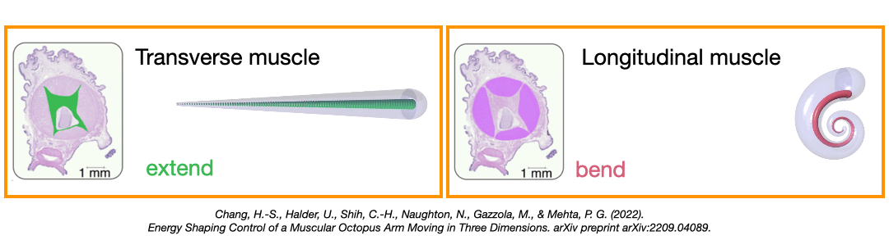
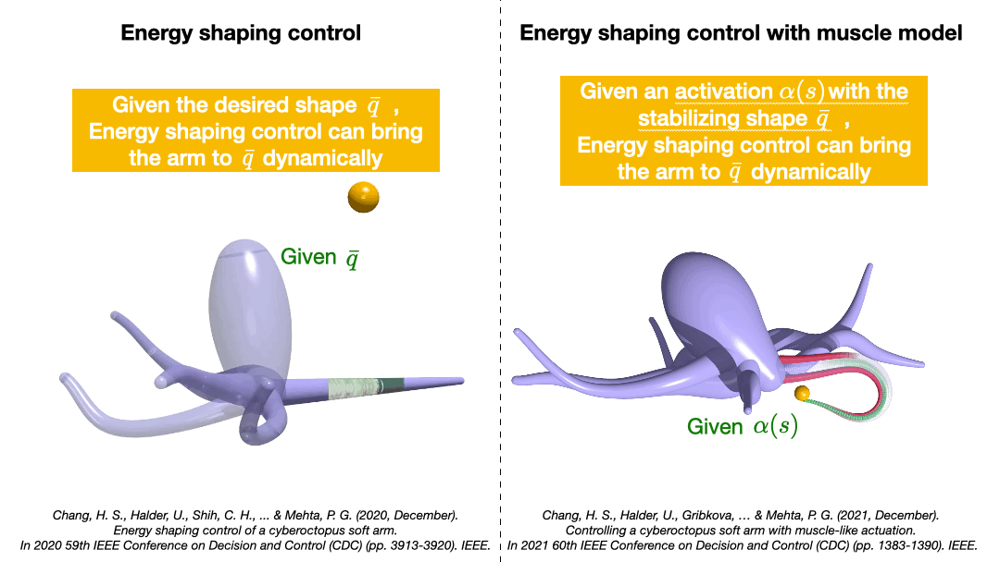
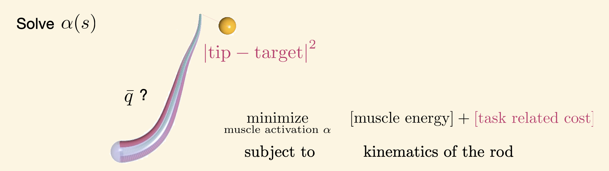
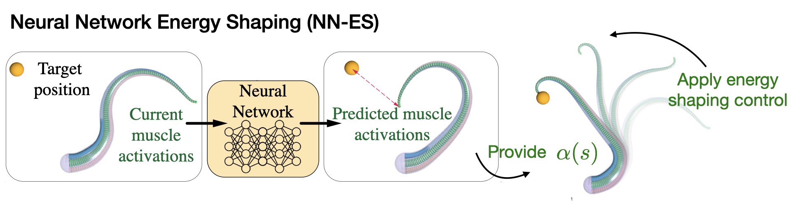
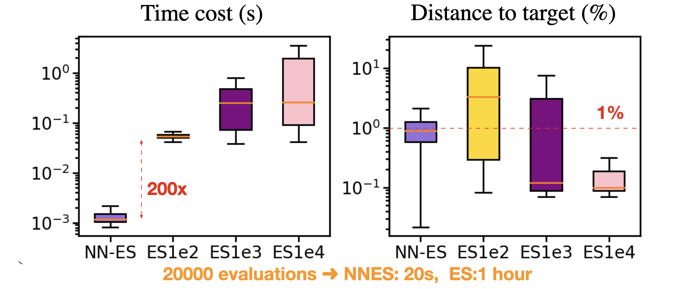
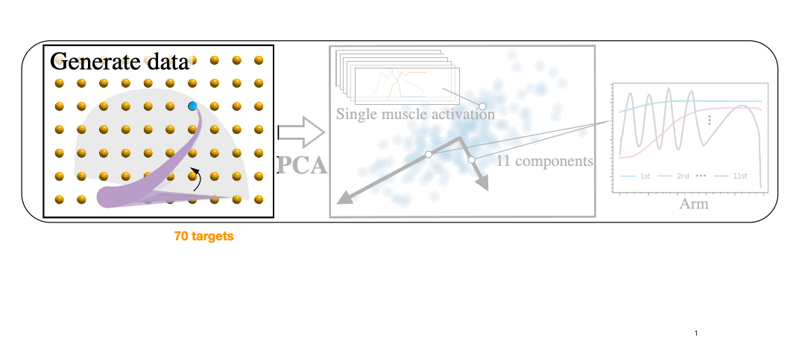
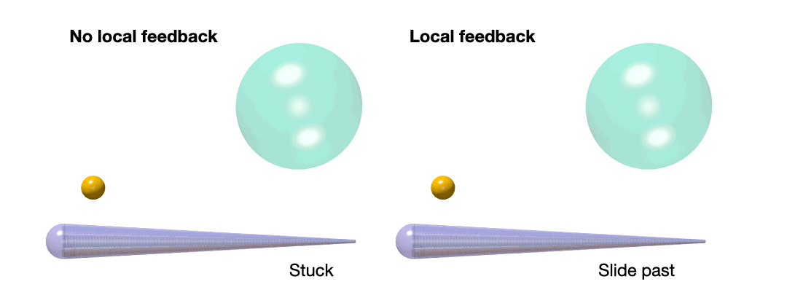

# Real-time-control-of-an-octopus-arm-NNES
One of the robotic analogies of an octopus arm is soft continuum manipulators. Given their potential to perform complex tasks in unstructured environments as well as to operate safely around humans, with applications ranging from agriculture to surgery, there are various proof-of-concept soft continuum manipulators with distinct designs, mechanisms and actuations. However, current studies overwhelmingly employ simplified models like constant curvature approximations or steady-state assumptions, which do not fully exploit soft material properties like high nonlinearity and inherent compliancy. 

In this project, I obtain a real-time controller for a soft arm to reach random targets in its workspace. The control approach is not only tailored to the distributed and compliant mechanical system, but also fast enough for real-time applications, learning purposes, and scaling up to multi-arm systems.

## Model an octopus arm as a Cosserat rod.
Cosserat rod model can represent slender rods  with one dimensional representation in space and account for bend, twist, stretch, and shear; allowing all possible modes of deformation to be considered under a wide range of boundary conditions. It models the rod as a deformable curve with attached deformable vectors to characterize its orientation, and evolves the system using a set of coupled second-order, nonlinear partial differential equations. Here, I used [Elastica](https://www.cosseratrods.org).

## Activation model using an octopus-like muscular structure
To get closer to the robotic setup, the arm is coupled with an actuation model inspired by octopus musculature. For 2d motion, it’s sufficient to consider the transverse muscles that allow the arm to extend and the longitudinal muscles that allow the arm to bend. We define the muscle activation to be continuous along the arm and has value between 0 to 1. Based on the muscles’ offset to the centerline, the activation directly maps to the forces and the couples on the Cosserat rod.

## Energy shaping control
Energy shaping control has been applied to the aforementioned arm by treating it as a hamiltonian control system [1-3]. The hamiltonian is the sum of kinetic energy and the potential energy, where the potential energy function is the key of the distributed control because (1) with the fixed boundary condition of the rod, the potential energy in terms of the configuration state can be described with the rod’s mechanical deformation. (2) The minima of the potential energy then represents the intrinsic deformations of the rod. Therefore, say if we want the arm to get to a specific configuration, we can define a desired potential energy function with minimum at the corresponding deformation. 

Based on this observation, energy shaping control law is designed so that it modifies the potential energy landscape with the minima at the desired static configuration. So for reaching a target, we simply need to solve for the desired configuration $\bar{q}$ (or the activation $\alpha(s)$ that corresponds to it)  so that energy shaping control law can bring the arm there dynamically.

However,  getting this activation is computationally expensive. We need to solve this optimization problem: 

This means we not only have to solve for this distributed muscle activations, but also the stabilizing shape q bar that is unknown to us.

In the original paper, they apply an iterative method to solve this optimization problem. At every iteration, both $\bar{q}$ and $\alpha$ need to be updated, and this goes on until getting the solution. In addition, the procedure needs to done every time when there is a new target, which can be challenging for real-time applications. It also scales up when we need to consider more muscles or more arms (for an octopus robot). 

## Neural network energy shaping control (NNES)
For real-time applications and later training purposes, I build a fast solver to output activations to the energy shaping controller [4]. I replaced the iterative method with a mapping that can provide muscle activations given any targets in the workspace and the current activations. The mapping is trained with a loss function in terms of distance error and energy costs using gradient descent (unsupervised learning). The learned mapping can provide activation solutions to the energy shaping control. Together, this NNES controller can bring the arm tip to the target, with the shape determined by the activations.

## 200 times faster than the iterative method!
I implement ES with 100, 1000, and 10000 maximum number of iterations. While the ES performance depends on the allowed iterations, the result shows a clear trend of ES and NNES. Both algorithms are accurate in reaching targets with median distances less than 1% of the arm. However, NNES has the advantage of a significant reduction in solution time, where NN-ES outperforms ES by over 200x. That means, For 20000 evaluations, NNES needs only 20s, while ES will require more than 1 hour.

---

## Compact representation for the continuous muscle activations
To efficiently learn the mapping, I construct a a compact representation for the continuous activations. I consider 70 uniformly distributed food targets around the workspace, and for each, I use the iterative method to solve for the muscle activations. Given the three muscle groups LM1, LM2, and TM, total 210 activations are generated. I then perform Principal Component Analysis on these muscle activations for dimensionality reduction  Basically, PCA projects each data point onto only the first few principal components to obtain lower-dimensional data 
And this can be done by picking the eigenvectors of the data matrix that correspond to the few biggest eigenvalues. 

I select the first 11 principal components and plot them as a function of the arm length. Since the linear combination of these components forms a muscle activation, I consider these 11 eigenvectors as the basis functions for the muscle activation, and treat the 11 coefficients as the control variables.

---

## Reaching a target in the presence of a solid obstacle
NN-ES is fast and accurate in reaching targets, but what if there is an obstacle? Given this dynamic controller is driven by static activations, the arm can get stuck if the obstacle is on the way. So without further burdening control or training, I implement a simple sensory feedback law — when the arm touches an obstacle, two signals emanate from the point of contact in each direction. One signal goes toward the arm’s tip for muscle relaxation, the other signal travels toward the arm’s base, and triggers the arm to bend. Once contact ceases, the arm returns to executing the original muscle activations. This law together with the compliant nature of the arm, allow the arm to slip past the obstacle with minimal computational effort. 

---

[1] Chang, H.-S., Halder, U., Shih, C.-H., Naughton, N., Gazzola, M., & Mehta, P. G. (2022). Energy Shaping Control of a Muscular Octopus Arm Moving in Three Dimensions. arXiv preprint arXiv:2209.04089.

[2] Chang, H.-S., Halder, U., Gribkova, E., Tekinalp, A., Naughton, N., Gazzola, M., & Mehta, P. G. (2021, December). Controlling a cyberoctopus soft arm with muscle-like actuation. In 2021 60th IEEE Conference on Decision and Control (CDC) (pp. 1383-1390). IEEE.

[3] Chang, H.-S., Halder, U., Shih, C.-H., Tekinalp, A., Parthasarathy, T., Gribkova, E., ... & Mehta, P. G. (2020, December). Energy shaping control of a cyberoctopus soft arm. In 2020 59th IEEE Conference on Decision and Control (CDC) (pp. 3913-3920). IEEE.

[4] Shih, C.-H., Naughton, N., Halder, U., ... & Gazzola, M. (2022) Hierarchical control and learning of a foraging CyberOctopus.
